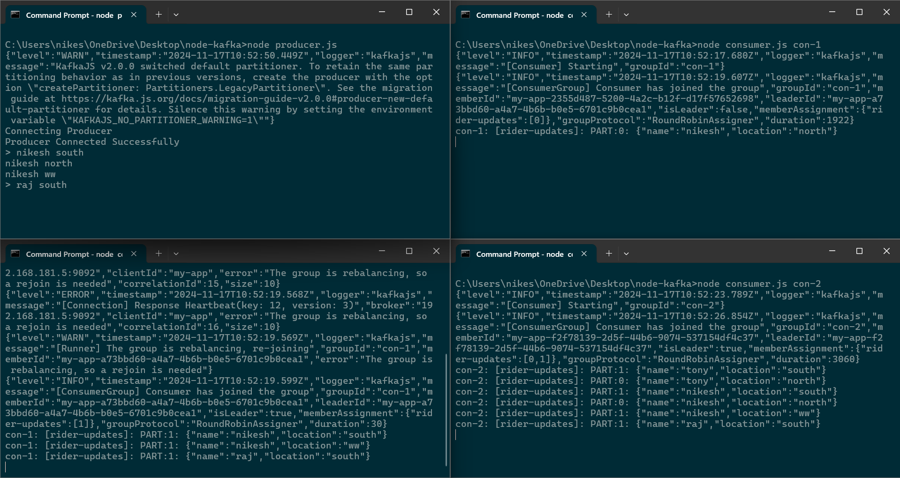

#Kafka-nodejs



a simple example of implemenation of kafka with nodejs.

## Prerequisite
- Knowledge
  - Node.JS Intermediate level
  - Experience with designing distributed systems
- Tools
  - Node.js: [Download Node.JS](https://nodejs.org/en)
  - Docker: [Download Docker](https://www.docker.com)
  - VsCode: [Download VSCode](https://code.visualstudio.com)

## Commands
- Start Zookeper Container and expose PORT `2181`.
```bash
docker run -p 2181:2181 zookeeper
```
- Start Kafka Container, expose PORT `9092` and setup ENV variables.
```bash
docker run -p 9092:9092 \
-e KAFKA_ZOOKEEPER_CONNECT=<PRIVATE_IP>:2181 \
-e KAFKA_ADVERTISED_LISTENERS=PLAINTEXT://<PRIVATE_IP>:9092 \
-e KAFKA_OFFSETS_TOPIC_REPLICATION_FACTOR=1 \
confluentinc/cp-kafka
```

## Run Locally

Clone the project

```bash
  git clone https://github.com/Nikeshchaudhary52494/kafka-nodejs.git
```

Go to the project directory

```bash
  cd kafka-nodejs
```

Install dependencies
```bash
  npm i
```
replace <PRIVATE_IP> in client.js with your localIP address.

- Run Multiple Consumers
```bash
node consumer.js <GROUP_NAME>
```
- Create Producer
```bash
node producer.js
```
```bash
> tony south
> tony north
```

